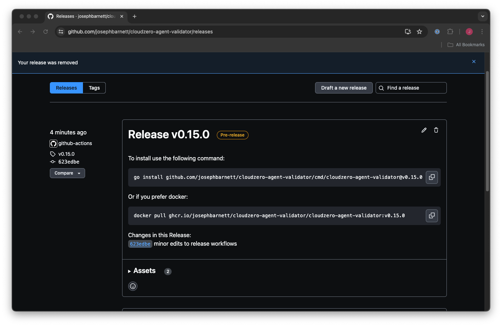

# Developers Quick Start

## Prerequisites

Before getting started with the development of the CloudZero Agent Validator, make sure you have the following prerequisites installed on your system:

- [Go 1.23+](https://go.dev/doc/install)
- [Docker](https://docs.docker.com/engine/install/)
- [Rancher Desktop - recommended for testing](https://ranchermanager.docs.rancher.com/getting-started/installation-and-upgrade)
- [Github Actions Utility - for local ci/cd testing](https://github.com/nektos/act)
- [Protocol buffer](https://developers.google.com/protocol-buffers) compiler, `protoc`, [version 3](https://protobuf.dev/programming-guides/proto3).
- **Go plugins** for the protocol compiler:

    1. Install the protocol compiler plugins for Go using the following commands:

        ```sh
        $ go install google.golang.org/protobuf/cmd/protoc-gen-go@v1.28
        $ go install google.golang.org/grpc/cmd/protoc-gen-go-grpc@v1.2
        ```

    2. Update your `PATH` so that the `protoc` compiler can find the plugins:

        ```sh
        $ export PATH="$PATH:$(go env GOPATH)/bin"
        ```

## Development Quick Start

To quickly get started with the development of the CloudZero Agent Validator, follow these steps:

### 1. Repository Setup

1. Clone the repository:

     ```sh
     $ git clone https://github.com/Cloudzero/cloudzero-agent-validator.git
     ```

2. Change to the project directory:

     ```sh
     $ cd cloudzero-agent-validator
     ```

### 2. Building the Code

1. Install the project dependencies:

     ```sh
     $ go mod download
     ```

2. Generate the status protobuf definition package:

     ```sh
     $ make generate
     ```

3. Build the binary:

     ```sh
     $ make build
     ```

### 3. Local Testing 

To run the go formatter, go linter, unit tests to verify code changes, use the following command:

```sh
make fmt lint test
```

### 4. CI/CD Testing

Several workflows are defined in the [.github/workflows](.github/workflows) directory to ensure code quality. Before opening a pull request, it is recommended to run these workflows.

#### Listing Available Workflows

To see the available workflows, run:

```sh
act --container-architecture linux/arm64 -l
```

**Example:**

```sh
$ act --container-architecture linux/arm64 -l
Stage  Job ID   Job name  Workflow name   Workflow file        Events           
0      docker           docker           DockerBuild             docker-build.yml     push,pull_request,release
0      build            build            GoTest                  golang-build.yml     push                     
0      format           format           GoFmt                   golang-fmt.yml       push                     
0      lint             lint             GoLint                  golang-lint.yml      push                     
0      release-to-main  release-to-main  Manual Prepare Release  release-to-main.yml  workflow_dispatch       
```

#### Linting a Workflow

If you are working on the CI/CD Action Workflows, it is useful to perform a `--dry-run` on the workflow to ensure the syntax is valid. To do this, run:

```sh
$ act --container-architecture linux/arm64 --dryrun -j lint
```

#### Running a Workflow

To run a workflow, use the `Job ID` value and pass it into the following command:

```sh
$ act --container-architecture linux/arm64 -j lint
...
[GoLint/lint] Cleaning up container for job lint
[GoLint/lint] 🏁  Job succeeded
```

For more examples, [see the README in the workflow directory](./.github/workflows/README.md).

Remember to refer to the available targets in the Makefile for other development tasks.

---
# Release Process

Publishing a new release can be accomplished by running the `Manual Prepare Release` workflow.


**Once run the following occurs:**

1. _All changes on the `develop` branch_ are merged into the `main` branch.
2. A new semver `tag` is created.
3. A new `pre-release` is created, with the `change log` for changes since the last release.

Next we can visit the release page, and locate the `pre-release` and `click the edit icon`:


Finally - we will publish the `draft-release`. Make sure you:
1. Remove the `draft` checkbox
2. Update _`Set as pre-release`_ to **`Set as the latest release`**


When this is done, it will cause an automated release of teh `docker image` for the release value, and `latest` to be created in GHCR. 

That's it, Happy coding!
