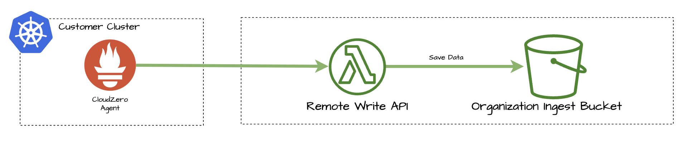

# Cirrus Remote Write Project: Fast API Implementation

## Executive Summary

The **Cirrus Remote Write API** serves as the primary interface for our customers' clusters, managing data ingestion from the **CloudZero Agent** and storing it in **S3** for subsequent processing. Currently, the API encounters challenges related to high operational costs and prolonged invocation durations, which adversely affect our [Concurrent Executions Quota](https://docs.aws.amazon.com/lambda/latest/dg/lambda-concurrency.html). To mitigate these issues, a **Proof of Value (PoV)** was conducted to assess the feasibility of transitioning from Python to **Go**, with the objectives of enhancing performance, reducing costs, and optimizing quota usage. The PoV results demonstrate significant improvements, projecting up to **93% cost savings** and a **13.6-fold reduction** in concurrent executions, thereby promising substantial yearly savings and operational efficiencies. **If no action is taken, the current implementation (assuming no usage growth) is projected to cost `$87,192` over 24 months, whereas the new Go implementation would reduce this cost to `$6,102` over the same period.** _It is anticipated that these results can be achieved within a single development story._

Furthermore, the provided implementation allows for the source code to be readily adapted to develop a client-side collector. This collector would enable fault recovery mechanisms, such as during key rotations, thereby enhancing the robustness and reliability of the CloudZero Agent solution.

---

## Introduction

The **Cirrus Remote Write API** serves as the primary interface for our customers' clusters. It accepts calls from the **CloudZero Agent** operating within a customer's cluster and stores the received data in **S3** for subsequent processing.



---

## Current Challenges with the Remote Write API

1. **Cost:**  
   The current API incurs high costs that scale with the number of managed clusters. For instance, sampling every 60 seconds results in 60 API invocations per minute, totaling 3,600 per hour. In practice, we observe approximately 1,500 invocations per hour, likely due to the CloudZero Agent's remote write processing logic.

2. **Invocation Duration:**  
   The duration of each API invocation impacts both costs and our [Concurrent Executions Quota](https://docs.aws.amazon.com/lambda/latest/dg/lambda-concurrency.html). This quota is shared across the entire organization, necessitating conscious decisions when onboarding new customers and clusters to avoid exhausting the quota allocated to other CloudZero features.

---

## Proof of Value (PoV)

A **Proof of Value (PoV)** was conducted to evaluate whether an alternative programming language could better serve the Remote Write API, focusing on performance, cost, and quota implications.

Research indicates that **Go** implementations [perform on average 50x to 100x faster than Python](https://blog.scanner.dev/serverless-speed-rust-vs-go-java-python-in-aws-lambda-functions/). Consequently, a PoV was developed using **Go** to assess potential improvements. **Go** was selected because Team Cirrus is already producing Go applications for customer clusters.

The Go implementation was deployed on AWS behind an API Gateway. Upon invocation, it validates inputs and writes the data to the appropriate S3 bucket for the organization.

To validate invocation duration, a shell script was created to invoke the API using real data from the Alfa CloudZero Organization bucket.

---

## Current Statistics

| **Metric**                             | **Value**                                                                                                                                                                                    |
|----------------------------------------|----------------------------------------------------------------------------------------------------------------------------------------------------------------------------------------------|
| **Average Concurrent Executions / Sec** | [354](https://cloudzero.sumologic.com/metrics-search/rhPBhCQfE5TWxsTQqVb54rM91bUoOEa9PGHJQzmM)                                                                                             |
| **Average Duration**                   | [953 ms](https://cloudzero.sumologic.com/metrics-search/Ouk1wqBdHtx7iC7L4RNzCLwoyxPd6K1C8TrfSBVB)                                                                                           |
| **Average Cold Start Duration**        | [10,600 ms](https://cloudzero.sumologic.com/metrics-search/gvMgoIZBfarNYkcEPIBGb27Kl29LxWOOmo6Ccaio)                                                                                      |
| **Average Invocations / Cluster / Hour** | 1,500 invocations                                                                                                                                                                            |
| **Current Monthly Cost**               | [$3,633](https://app.cloudzero.com/inventory/czrn%3Aaws%3Alambda%3Aus-east-1%3A931830253929%3Afunction%3Acz-live-container-analysis-post-container-metrics?activeCostType=real_cost&granularity=daily&dateRange=Last%2030%20Days&partitions=usage_type) |
| **12-Month Cost Estimate**             | `$43,596`                                                                                                                                                                                     |
| **24-Month Cost Estimate**             | `$87,192`                                                                                                                                                                                     |

---

## PoV Result Summary

| **Metric**                           | **Value** |
|--------------------------------------|-----------|
| **Go Change Expected Savings**       | `93%`     |
| **12-Month Cost Estimate**           | `$3,051`  |
| **24-Month Cost Estimate**           | `$6,102`  |
| **Average Runtime**                  | `70 ms`   |
| **Cold Start Time**                  | `870 ms`  |

> **_These estimates imply a 12x yearly savings for this API alone._**

---

## Understanding the Data and Concerns

The following table outlines various concerns that must be considered when deciding whether to **maintain the current implementation** or **advocate for the proposed change**.

| **Metric**               | **Description**                                                                                                                                                                                                                                                                         |
|--------------------------|-----------------------------------------------------------------------------------------------------------------------------------------------------------------------------------------------------------------------------------------------------------------------------------------|
| **Lambda Cost**          | Lambda functions are billed based on architecture, duration, and requests. **_Our estimates are based on a `128MB` Lambda profile, billed per millisecond at the rate of `$0.0000000017/ms`._** For more details, visit the [AWS Pricing Page](https://aws.amazon.com/lambda/pricing).                       |
| **Concurrent Invocations** | CloudZero accounts have a [limited quota](https://docs.aws.amazon.com/lambda/latest/dg/lambda-concurrency.html) for concurrent executions. Our goal is to ensure that Cirrus does not consume the entire quota, preserving capacity for other features.                                    |

**_Forecast estimates assume no future growth in customer or cluster counts, as it's impossible to predict the exact number of new additions or their timing. These forecasts are based on the current volume without anticipated changes._**

---

## Method of Forecast Interpretation

The performance improvements from the Go implementation are significant compared to the Python version. Key highlights include:

### Performance Improvement

- **Cold Start Time:** Reduced from **10,600 ms (Python)** to **870 ms (Go)**.
- **Average Duration:** Reduced from **953 ms (Python)** to **70 ms (Go)**.

### Cost Savings

The reduction in average duration from **953 ms** to **70 ms** results in an approximate **93% cost saving**, assuming costs scale directly with billed duration.

### Reduction in Concurrent Executions

- **Formula:**

  ```
  Reduction in Concurrent Executions = Average Duration (Python) / Average Duration (Go)
  ```

- **Calculation:**

  ```
  Reduction in Concurrent Executions = 953 ms / 70 ms ≈ 13.6
  ```

- **Implication:** The Go implementation requires approximately **13.6 times fewer concurrent executions** compared to Python for the same load.

### Raw Data from Fast API Implementation

Below are examples of billed durations for invocations recorded in CloudWatch logs:

```sh
Duration: 770.04 ms Billed Duration: 870 ms Memory Size: 128 MB Max Memory Used: 36 MB Init Duration: 99.83 ms
Duration: 47.24 ms Billed Duration: 48 ms Memory Size: 128 MB Max Memory Used: 36 MB
Duration: 80.98 ms Billed Duration: 81 ms Memory Size: 128 MB Max Memory Used: 36 MB
...
Duration: 43.09 ms Billed Duration: 44 ms Memory Size: 128 MB Max Memory Used: 38 MB
Duration: 93.66 ms Billed Duration: 94 ms Memory Size: 128 MB Max Memory Used: 38 MB
Duration: 86.79 ms Billed Duration: 87 ms Memory Size: 128 MB Max Memory Used: 38 MB
Duration: 37.02 ms Billed Duration: 38 ms Memory Size: 128 MB Max Memory Used: 38 MB
Duration: 32.53 ms Billed Duration: 33 ms Memory Size: 128 MB Max Memory Used: 38 MB
Duration: 85.00 ms Billed Duration: 86 ms Memory Size: 128 MB Max Memory Used: 38 MB
Duration: 30.27 ms Billed Duration: 31 ms Memory Size: 128 MB Max Memory Used: 38 MB
Duration: 118.39 ms Billed Duration: 119 ms Memory Size: 128 MB Max Memory Used: 38 MB
Duration: 31.11 ms Billed Duration: 32 ms Memory Size: 128 MB Max Memory Used: 38 MB
Duration: 56.95 ms Billed Duration: 57 ms Memory Size: 128 MB Max Memory Used: 38 MB
Duration: 27.52 ms Billed Duration: 28 ms Memory Size: 128 MB Max Memory Used: 38 MB
Duration: 99.35 ms Billed Duration: 100 ms Memory Size: 128 MB Max Memory Used: 38 MB
```

*Note: The first entry indicates a cold start, while subsequent entries represent typical "hot" invocations.*

*Additionally, note that 128MB was allocated for the lambda, however only 38MB was actively used. This indicates we could handle larger time-series batch sizes without any or significant changes to the PoV*

*For a complete list of billed durations, please [refer to the Research Account CloudWatch logs directly](https://us-east-1.console.aws.amazon.com/cloudwatch/home?region=us-east-1#logsV2:log-groups/log-group/$252Faws$252Flambda$252Ffastapi-FastRemoteWritePostFunction-pC7T5eWXvFzp/log-events$3FfilterPattern$3D$2522Billed+Duration$2522).*

---

## Additional Thoughts

This Proof of Value (PoV) centers on replacing our AWS server-side Lambda function. The PoV application can be swiftly adapted to operate within the customer environment as a collector, which exposes a local remote write endpoint, saves data to disk, aggregates the data into larger batches, and subsequently pushes it to our Remote Write API.

This foundation offers enhanced resilience against communication failures, ensuring that no data is lost. Currently, we encounter challenges when a customer is unable to write to our API for durations exceeding two hours.

---

## Conclusion

Transitioning the **Cirrus Remote Write API** from Python to **Go** presents a compelling opportunity to enhance performance, significantly reduce costs, and optimize the use of our [Concurrent Executions Quota](https://docs.aws.amazon.com/lambda/latest/dg/lambda-concurrency.html). The **Proof of Value (PoV)** demonstrates that adopting Go can lead to up to **93% cost savings** and a **13.6-fold reduction** in concurrent executions, translating to substantial yearly savings and improved operational efficiency. Moving forward, implementing this change will not only address the current challenges but also provide a scalable foundation to support future growth without compromising on performance or cost-effectiveness.

---