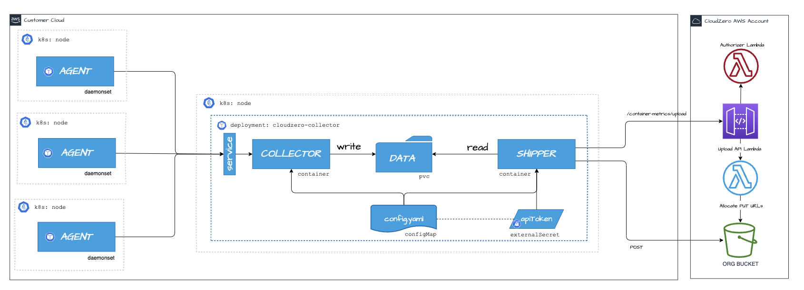

# CloudZero Agent

[](CODE-OF-CONDUCT.md)
[](LICENSE)


This repository contains several applications to support Kubernetes integration
with the CloudZero platform, including:

- _CloudZero Webhook Server_ - provides telemetry to the CloudZero platform enabling complex cost allocation and analysis. This webhook application securely receives resource provisioning and deprovisioning requests from the Kubernetes API. It collects resource labels, annotations, and relationship metadata between resources, ultimately supporting the identification of CSP resources not directly connected to a Kubernetes node.

- _CloudZero Collector_ - The collector application which implements a prometheus compliant interface for metrics collection; which writes the metrics payloads to files to a shared location for consumption by the shipper. Today the collector classifies incoming metrics data, and will save the data into either cost telemetry files, or into observability files. These files are compressed on disk to save space.

- _CloudZero Shipper_ - The shipper application monitors shared locations for metrics file creation, allocates pre-signed S3 PUT URLs for customers (using the `CloudZero upload API`), and then uploads data to the AWS S3 bucket at set intervals. This approach protects against invalid API keys and enables end-to-end file tracking.

- _CloudZero Agent Validator_ - the validator application is part of the agent’s pod lifecycle hooks. It is responsible for performing basic validation checks, and notifying the CloudZero platform of installation status changes (initializing, started, stopping). This application runs during the lifecycle hook, then exits when complete.

> Note the **_Agent Component_** (Prometheus in agent mode) which is responsible for executing metrics scrape jobs at various intervals. The Prometheus agent communicates with kube-state-metrics and cAdvisor exporters to collect metrics, then forwards them to the CloudZero Collector via Prometheus remote write protocol. For large scale clusters, the agent runs in "federated mode" (aka DaemonSet mode), where each Prometheus agent instance on each node is responsible for metrics collection on that single node.

## ⚡ Getting Started With CloudZero Webhook Server

The easiest way to get started with the _CloudZero Webhook Server_ is by
using the `cloudzero-agent` Helm chart from the [cloudzero-charts
repository](https://github.com/Cloudzero/cloudzero-charts).

### Development

See the [Development Guide](./DEVELOPMENT.md) for comprehensive information about:

- Building and testing components
- Deployment workflows
- Multi-cluster development
- Making changes to the codebase

### Installation

See the [Installation Guide](./INSTALL.md) for details.

### Configuration

See the [Configuration Guide](./CONFIGURATION.md) for details.

#### Cleanup

```sh
# Remove build artifacts
make clean

# Delete KIND cluster and cleanup
make kind-down
```

### Debugging

The applications are based on a scratch container, so no shell is available. The
container images are less than 8MB.

To monitor the data directory, you must deploy a `debug` container as follows:

1. **Deploy a debug container**

   ```bash
   kubectl apply  -f cluster/deployments/debug/deployment.yaml
   ```

2. **Attach to the shell of the debug container**

   ```bash
   kubectl exec -it temp-shell -- /bin/sh
   ```

   To inspect the data directory, `cd /cloudzero/data`

---

### **Clean Up**

```bash
eksctl delete cluster -f cluster/cluster.yaml --disable-nodegroup-eviction
```

## Collector & Shipper Architecture



This project provides a collector application, written in golang, which provides two applications:

- `Collector` - the collector application exposes a prometheus remote write API
  which can receive POST requests from prometheus in either v1 or v2 encoded
  format. It decodes the messages, then writes them to the `data` directory as
  Brotri-compressed JSON.
- `Shipper` - the shipper application watches the data directory looking for
  completed parquet files on a regular interval (eg. 10 min), then will call the
  `CloudZero upload API` to allocate S3 Presigned PUT URLS. These URLs are used
  to upload the file. The application has the ability to compress the files
  before sending them to S3.

## Message Format

The output of the _CloudZero Webhook Server_ (formerly Insights Controller) application is a JSON object
that represents `cloudzero` metrics, which is POSTed to the CloudZero remote
write API. The format of these objects is based on the Prometheus `Timeseries`
protobuf message, defined in the
[Prometheus types.proto](https://github.com/prometheus/prometheus/blob/main/prompb/types.proto#L122-L130).
Protobuf definitions for the `cloudzero` metrics are in the `proto/` directory.

There are four kinds of objects that can be sent:

1. **Pod metrics**

### Pod Metric Names

- `cloudzero_pod_labels`
- `cloudzero_pod_annotations`

### Pod Required Fields

- `__name__`; will be one of the valid pod metric names
- `namespace`; the namespace that the pod is launched in
- `resource_type`; will always be `pod` for pod metrics

#### Pod Example

```json
{
  "labels": [
    {
      "name": "__name__",
      "value": "cloudzero_pod_labels"
    },
    {
      "name": "namespace",
      "value": "default"
    },
    {
      "name": "pod",
      "value": "hello-28889630-955wd"
    },
    {
      "name": "resource_type",
      "value": "pod"
    },
    {
      "name": "label_batch.kubernetes.io/controller-uid",
      "value": "cc52c38d-b461-40ab-a65d-2d5a68ac08e5"
    },
    {
      "name": "label_batch.kubernetes.io/job-name",
      "value": "hello-28889630"
    },
    {
      "name": "label_controller-uid",
      "value": "cc52c38d-b461-40ab-a65d-2d5a68ac08e5"
    },
    {
      "name": "label_job-name",
      "value": "hello-28889630"
    }
  ],
  "samples": [
    {
      "value": 1.0,
      "timestamp": "1733378003953"
    }
  ]
}
```

2. **Workload Metrics**

### Workload Metric Names

- `cloudzero_deployment_labels`
- `cloudzero_deployment_annotations`
- `cloudzero_statefulset_labels`
- `cloudzero_statefulset_annotations`
- `cloudzero_daemonset_labels`
- `cloudzero_daemonset_annotations`
- `cloudzero_job_labels`
- `cloudzero_job_annotations`
- `cloudzero_cronjob_labels`
- `cloudzero_cronjob_annotations`

### Workload Required Fields

- `__name__`; will be one of the valid workload metric names
- `namespace`; the namespace that the workload is launched in
- `workload`; the name of the workload
- `resource_type`; will be one of `deployment`, `statefulset`, `daemonset`,
  `job`, or `cronjob`

#### Workload Example

```json
{
  "labels": [
    {
      "name": "__name__",
      "value": "cloudzero_deployment_labels"
    },
    {
      "name": "namespace",
      "value": "default"
    },
    {
      "name": "workload",
      "value": "hello"
    },
    {
      "name": "resource_type",
      "value": "deployment"
    },
    {
      "name": "label_component",
      "value": "greeting"
    },
    {
      "name": "label_foo",
      "value": "bar"
    }
  ],
  "samples": [
    {
      "value": 1.0,
      "timestamp": "1733378003953"
    }
  ]
}
```

3. **Namespace Metrics**

### Namespace Metric Names

- `cloudzero_namespace_labels`
- `cloudzero_namespace_annotations`

### Namespace Required Fields

- `__name__`; will be one of the valid namespace metric names
- `namespace`; the name of the namespace
- `resource_type`; will always be `namespace` for namespace metrics

#### Namespace Example

```json
{
  "labels": [
    {
      "name": "__name__",
      "value": "cloudzero_namespace_labels"
    },
    {
      "name": "namespace",
      "value": "default"
    },
    {
      "name": "resource_type",
      "value": "namespace"
    },
    {
      "name": "label_engr.os.com/component",
      "value": "foo"
    },
    {
      "name": "label_kubernetes.io/metadata.name",
      "value": "default"
    }
  ],
  "samples": [
    {
      "value": 1.0,
      "timestamp": "1733880410225"
    }
  ]
}
```

4. **Node Metrics**

### Node Metric Names

- `cloudzero_node_labels`
- `cloudzero_node_annotations`

### Node Required Fields

- `__name__`; will be one of the valid node metric names
- `node`; the name of the node
- `resource_type`; will always be `node` for node metrics

#### Node Example

```json
{
  "labels": [
    {
      "name": "__name__",
      "value": "cloudzero_node_labels"
    },
    {
      "name": "resource_type",
      "value": "node"
    },
    {
      "name": "label_alpha.eksctl.io/nodegroup-name",
      "value": "spot-nodes"
    },
    {
      "name": "label_beta.kubernetes.io/arch",
      "value": "amd64"
    }
  ],
  "samples": [
    {
      "value": 1.0,
      "timestamp": "1733880410225"
    }
  ]
}
```

## 🤝 How to Contribute

We appreciate feedback and contribution to this repo! Before you get started,
please see the following:

- [This repo's contribution guide](CONTRIBUTING.md)

## 🤔 Support + Feedback

Contact support@cloudzero.com for usage, questions, specific cases. See the
[CloudZero Docs](https://docs.cloudzero.com/) for general information on
CloudZero.

## 🛡️ Vulnerability Reporting

Please do not report security vulnerabilities on the public GitHub issue
tracker. Email [security@cloudzero.com](mailto:security@cloudzero.com) instead.

## ☁️ What is CloudZero?

CloudZero is the only cloud cost intelligence platform that puts engineering in
control by connecting technical decisions to business results.:

- [Cost Allocation And Tagging](https://www.cloudzero.com/tour/allocation)
  Organize and allocate cloud spend in new ways, increase tagging coverage, or
  work on showback.
- [Kubernetes Cost Visibility](https://www.cloudzero.com/tour/kubernetes)
  Understand your Kubernetes spend alongside total spend across containerized
  and non-containerized environments.
- [FinOps And Financial Reporting](https://www.cloudzero.com/tour/finops)
  Operationalize reporting on metrics such as cost per customer, COGS, gross
  margin. Forecast spend, reconcile invoices and easily investigate variance.
- [Engineering Accountability](https://www.cloudzero.com/tour/engineering)
  Foster a cost-conscious culture, where engineers understand spend, proactively
  consider cost, and get immediate feedback with fewer interruptions and faster
  and more efficient innovation.
- [Optimization And Reducing Waste](https://www.cloudzero.com/tour/optimization)
  Focus on immediately reducing spend by understanding where we have waste,
  inefficiencies, and discounting opportunities.

Learn more about [CloudZero](https://www.cloudzero.com/) on our website
[www.cloudzero.com](https://www.cloudzero.com/)

## 📜 License

This project is licensed under the Apache 2.0 [LICENSE](LICENSE).
